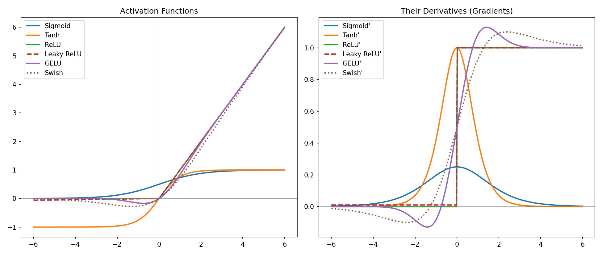
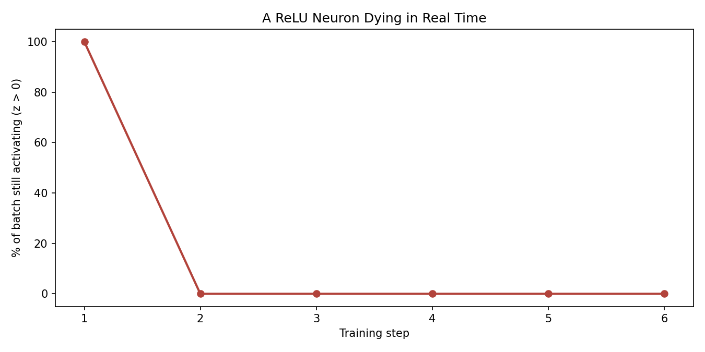

# Activation Functions From Scratch — Built With NumPy

Every major activation function and its exact derivative, implemented and
evaluated by hand in NumPy. No PyTorch, no TensorFlow.

Built to support a deep-dive article on Review Publically about how
activation functions actually behave, since most explainers describe
vanishing gradients and dying ReLU qualitatively but rarely show the
real numbers.

## What it shows

**1. Real gradient values, not just "vanishing gradient" as a phrase**

At x = 6, sigmoid's gradient has shrunk to 0.00246651, about 101 times
smaller than its peak gradient at x = 0. Stack enough sigmoid layers
and that shrinkage compounds until gradients reaching early layers
underflow toward zero. GELU and tanh are computed and plotted the
same way for direct comparison.

**2. A ReLU neuron dying, step by step, with real numbers**

A single neuron with an unlucky bias initialization is walked through
6 gradient descent steps against a batch of typical inputs:

| Step | Bias | Gradient | % of batch still activating |
|------|------|----------|------------------------------|
| 1 | 0.500 | 3.000 | 100% |
| 2 | -1.000 | 3.000 | 0% |
| 3 | -1.000 | 0.000 | 0% |
| 4-6 | -1.000 | 0.000 | 0% |

Once every input in the batch produces a negative pre-activation, ReLU's
gradient is exactly 0 everywhere in that batch, so the neuron stops
receiving any update at all, permanently. This is the dying ReLU
problem, caught in the act rather than described in the abstract.

**3. Modern transformer-era activations included**

Most explainers stop at ReLU. GELU (used in BERT and GPT) and Swish
are implemented exactly (GELU using the Gaussian CDF via `scipy.special.erf`,
not the tanh approximation) and plotted alongside the classics.




## Run it yourself

```bash
pip install numpy matplotlib scipy
python activation_functions.py
```

## Files

- `activation_functions.py` — all six activation functions, their
  derivatives, the gradient-shrinkage comparison, and the dying ReLU
  simulation
- `activation_functions.png` — functions and derivatives, side by side
- `dying_relu.png` — a neuron dying over 6 training steps

## Author

Khalid Hussain, founder of [Review Publically](https://reviewpublically.com),
MSc Computer Science, Google Advanced Data Analytics certified. Also built
[lstm-from-scratch](https://github.com/ReviewPublically/lstm-from-scratch)
and [self-attention-from-scratch](https://github.com/ReviewPublically/self-attention-from-scratch)
for companion articles on RNN/LSTM and Transformers.
# activation-functions-from-scratch
